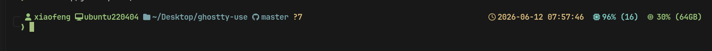

# 终端美化教程

这份文档不是只记录结果，而是教你这套终端美化是怎么组成的、以后想改哪里应该改哪个文件。

当前真机效果如下：



图里的 CPU、内存、主机名来自当前电脑，换电脑后会按那台机器实时生成。

实际 prompt 的结构大概长这样。CPU 核心数、内存容量、主机名都会按当前电脑自动变化，不是固定值：

```text
╭─ [用户] [电脑] [目录] [Git 分支] [改动标记]  [北京时间] [CPU 使用率/核心数] [内存使用率/总量]
╰─❯
```

在这台电脑上，它会类似这样：

```text
╭─  xiaofeng  ubuntu220404  ~/Desktop/projects/ubuntu-use/terminal/ghostty-use  master ●   2026-06-12 08:03:34  99% (16) 󰍛 29% (64GB)
╰─❯
```

## 先理解分工

终端美化分三层：

1. `Ghostty` 负责终端窗口本身：背景色、字体、字号、光标、边距。
2. `Starship` 负责命令行提示符：用户、电脑、目录、Git 分支、时间、CPU、内存。
3. `Nerd Font` 负责图标显示：如果没装字体，``、``、`` 这些图标会变成方块。文档截图来自真实 Ghostty 窗口；如果 Markdown 里代码块的图标显示异常，以 Ghostty 实际窗口为准。

所以以后调整时，不要把所有东西都往一个文件里找：

```text
Ghostty 外观       -> ~/.config/ghostty/config
Prompt 内容和顺序  -> ~/.config/starship.toml
Bash 启动 Starship -> ~/.bashrc
Bash 历史建议     -> ~/.blerc
```

## Bash 与 fish 的取舍

最初保留 Bash，是因为 `~/.bashrc` 已经接了 `nvm`、`pyenv`、`sdkman`，迁移成本较低。

后续实际试用发现，fish 原生的历史预测、补全 pager，以及 adb 手机路径补全更符合当前终端使用习惯。因此当前方案是：**Bash 保留不动，fish 已配置好用于试用**。

Starship 同时支持 Bash 和 fish，所以 prompt 配置不用重写。fish 迁移细节见：

```text
../fish-shell-migration.md
```

## 当前展示了什么

左侧是身份和项目状态：

```text
 xiaofeng  ubuntu220404  ~/Desktop/projects/ubuntu-use/terminal/ghostty-use  master ●
```

含义：

- ` xiaofeng`：当前用户
- ` ubuntu220404`：当前电脑/主机
- ` ~/Desktop/projects/ubuntu-use/terminal/ghostty-use`：当前目录
- ` master`：当前 Git 分支
- `●`：Git 工作区有改动或未跟踪文件；干净时不显示

右侧是系统状态：

```text
 2026-06-12 08:03:34  99% (16) 󰍛 29% (64GB)
```

含义：

- ` 2026-06-12 08:03:34`：北京时间，不显示时区后缀
- ` 99% (16)`：CPU 使用率估算，括号里是当前电脑的核心数；这台机器是 16 核，别的电脑会不同
- `󰍛 29% (64GB)`：内存使用率，括号里是当前电脑的标称内存；这台机器显示 64GB，别的电脑会不同

## 历史命令提示

当前 Bash 保留 `ble.sh` 配置作为可选的 PowerShell PSReadLine 类历史提示：

- 启用后，输入命令前缀会自动弹出最多 5 条匹配的历史命令
- 右方向键可以接受灰色内联建议
- 上/下方向键会按当前已输入前缀搜索历史

另外保留两个手动查看历史的快捷命令：

```bash
h5   # 查看最近 5 条历史命令
h10  # 查看最近 10 条历史命令
```

相关配置：

- `~/.bashrc`：默认不加载 `ble.sh`，避免 Ghostty 首屏 prompt 重绘两次；需要时可用 `BASH_ENABLE_BLESH=1 bash` 进入启用 ble.sh 的子 shell
- `~/.blerc`：控制自动建议、候选菜单最多 5 行、方向键行为

历史相关设置：

- `HISTSIZE=10000`
- `HISTFILESIZE=20000`
- `HISTCONTROL=ignoreboth:erasedups`
- `HISTTIMEFORMAT='%F %T  '`
- 每次命令后同步历史，多个终端窗口之间能更快看到彼此的命令记录

## 图标对照

如果 Markdown 里图标看不清，以这个表为准。真实 Ghostty 里使用 Nerd Font 后会正常显示。

| 图标 | 文本标签 | 含义 |
| --- | --- | --- |
| `` | USER | 当前用户 |
| `` | HOST | 当前电脑/主机 |
| `` | DIR | 当前目录 |
| `` | GIT | Git 分支 |
| `●` | DIRTY | Git 工作区有改动 |
| `` | TIME | 北京时间 |
| `` | CPU | CPU 使用率和核心数 |
| `󰍛` | RAM | 内存使用率和总量 |

## 硬件信息怎么来的

CPU 和内存不是写死在文档里的，它们来自 `~/.config/starship.toml` 里的自定义模块。

CPU 模块会读取 `/proc/stat` 估算使用率，并用 `nproc` 读取核心数：

```toml
[custom.cpu]
command = '''awk '...' /proc/stat; printf " (%s)" "$(nproc)"'''
```

内存模块会用 `free -b` 读取当前机器的内存，再换算成常见标称容量：

```toml
[custom.ram]
command = "free -b | awk '...'"
```

所以换到另一台电脑后，例如 8 核 32GB，prompt 会自然变成类似：

```text
 12% (8) 󰍛 41% (32GB)
```

## 当前不展示什么

为了避免 prompt 太长，暂时不展示这些：

- 退出码
- 命令耗时
- 后台任务数
- sudo 状态
- Node/Python/Java/Rust/Go 版本
- Python venv/conda
- Docker/Kubernetes context
- 磁盘占用
- 电池电量
- SSH 状态

如果以后要加，建议只加“进入相关项目时才显示”的模块，不建议全部常驻。

## 怎么改 Prompt

Prompt 配置文件是：

```bash
~/.config/starship.toml
```

仓库里有一份可参考配置：

```bash
configs/starship.toml
```

最重要的是开头这段：

```toml
format = """
[╭─](fg:surface0)$username$hostname$directory$git_branch${custom.git_dirty}$fill${custom.local_time}${custom.cpu}${custom.ram}
[╰─](fg:surface0)$character"""
```

这段决定了显示顺序。

想隐藏 CPU，删除：

```toml
${custom.cpu}
```

想隐藏内存，删除：

```toml
${custom.ram}
```

想隐藏时间，删除：

```toml
${custom.local_time}
```

想隐藏 Git 的脏状态圆点，删除：

```toml
${custom.git_dirty}
```

## 怎么改时间

当前时间固定为北京时间：

```toml
[custom.local_time]
command = "TZ=Asia/Shanghai date '+%Y-%m-%d %H:%M:%S'"
```

如果想改成本机时区：

```toml
command = "date '+%Y-%m-%d %H:%M:%S'"
```

如果只想显示时分秒：

```toml
command = "TZ=Asia/Shanghai date '+%H:%M:%S'"
```

## 怎么改 Git 显示

当前分支显示：

```toml
[git_branch]
symbol = " "
format = "[$symbol$branch]($style) "
```

如果 GitHub 图标不喜欢，可以换成普通分支图标：

```toml
symbol = " "
```

当前 `●` 是自定义模块，不显示数量，只提醒“这个仓库不干净”：

```toml
[custom.git_dirty]
command = "git status --porcelain 2>/dev/null | awk 'NR==1 {print \"●\"; exit}'"
when = "git rev-parse --is-inside-work-tree >/dev/null 2>&1 && test -n \"$(git status --porcelain 2>/dev/null)\""
```

如果你觉得圆点也不需要，把 `format` 里的 `${custom.git_dirty}` 删除即可。

## 怎么验证

修改 `~/.config/starship.toml` 后，开一个新的 Ghostty 窗口。

也可以直接预览 prompt：

```bash
starship prompt --path "$PWD" --logical-path "$PWD" --terminal-width 140
```

修改 `~/.bashrc` 后，检查有没有报错：

```bash
bash --noprofile --norc -lc "source ~/.bashrc"
```

## 如果图标显示成方块

先检查字体：

```bash
fc-match "JetBrainsMono Nerd Font"
```

正常应该看到类似：

```text
JetBrainsMonoNerdFont-Regular.ttf: "JetBrainsMono Nerd Font" "Regular"
```

再检查 Ghostty 是否使用这个字体：

```bash
ghostty +show-config | grep font-family
```

应该能看到：

```text
font-family = JetBrainsMono Nerd Font
```

## 回滚

本次修改前的备份在：

```bash
~/Desktop/projects/ubuntu-use/terminal/ghostty-use/backups/
```

查看最近一次备份时间：

```bash
cat ~/Desktop/projects/ubuntu-use/terminal/ghostty-use/backups/latest-backup.txt
```

恢复 Ghostty：

```bash
cp ~/Desktop/projects/ubuntu-use/terminal/ghostty-use/backups/ghostty-config.<timestamp>.bak ~/.config/ghostty/config
```

恢复 Bash：

```bash
cp ~/Desktop/projects/ubuntu-use/terminal/ghostty-use/backups/bashrc.<timestamp>.bak ~/.bashrc
```

如果有 Starship 备份，也可以恢复：

```bash
cp ~/Desktop/projects/ubuntu-use/terminal/ghostty-use/backups/starship.<timestamp>.bak ~/.config/starship.toml
```

## 参考

- Starship 官方文档：https://starship.rs/
- Starship Presets：https://starship.rs/presets/
- Ghostty 配置文档：https://ghostty.org/docs/config/reference
